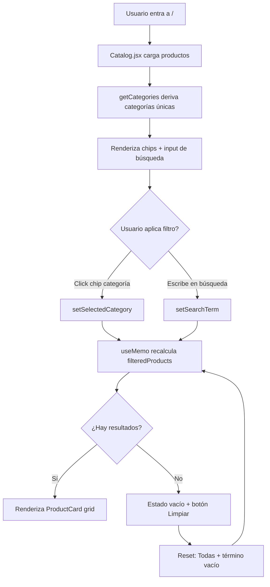

# CocinaStore — Catálogo de ventas (demo)

Sitio web en React: catálogo de productos de cocina con login, direcciones, carrito y pago con tarjeta **simulado** (solo demostración, no real).

## Cómo ejecutar

```bash
npm install
npm run dev
```

Abre en el navegador la URL que muestre Vite (por ejemplo `http://localhost:5173`).

## Funcionalidades

- **Catálogo**: productos de cocina (sartenes, ollas, electrodomésticos, etc.) con **filtro por categorías** y **búsqueda por nombre**.
- **Login**: usuario de prueba **demo@cocina.com** / **demo123**.
- **Mi cuenta**: gestión de direcciones de envío (añadir, editar, eliminar).
- **Carrito**: añadir productos, cambiar cantidades, ir a pagar.
- **Checkout**: elegir dirección de envío y formulario de pago con tarjeta (simulado, aspecto realista pero no procesa pagos reales).

## Filtrado por categorías (HU-NT8R)

El catálogo permite filtrar por categoría mediante chips interactivos y por texto con una barra de búsqueda. Todo el filtrado ocurre en el cliente sobre el dataset `src/data/products.js`, por lo que la respuesta es **inmediata (<500 ms)**. Si no hay coincidencias se muestra un estado vacío con la acción **Ver todo el catálogo**.



### Accesibilidad

- Grupo de chips con `role="group"` y `aria-label`.
- Botones con `aria-pressed` para indicar categoría activa.
- Contador de resultados con `aria-live="polite"`.

## Variables de entorno (Netlify)

La función serverless `netlify/functions/auth/auth.js` requiere:

- `MONGODB_URI` — cadena de conexión a MongoDB Atlas.
- `MONGODB_DATABASE` — por defecto `catalogo-demo`.
- `MONGODB_COLLECTION` — por defecto `users-prod`.

No se almacenan credenciales en el repositorio.

## Nota

El pago con tarjeta es **solo visual/demo**. Los datos no se envían a ningún servidor ni se cobra nada. Sirve para probar el flujo de compra.
