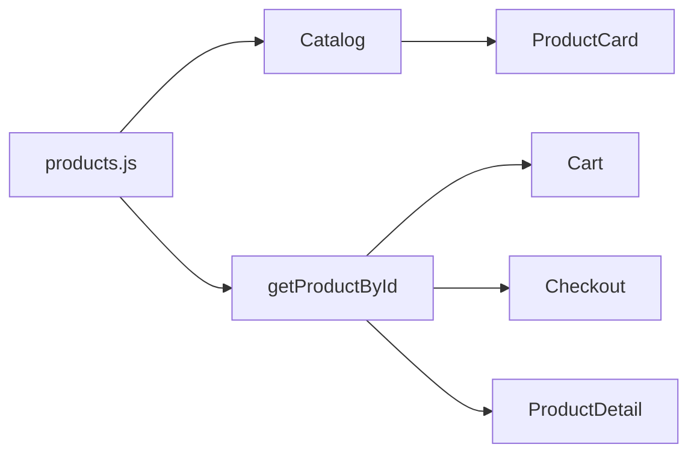

# Reporte de estructura: `src/data/products.js`

## Fuente

- Archivo: [src/data/products.js](../src/data/products.js)
- Exporta: `products` (array de 10 ítems) y `getProductById(id)`.

## Esquema de cada producto

| Campo | Tipo inferido | Obligatoriedad | Observaciones |
|--------|----------------|----------------|---------------|
| `id` | `string` | Sí | Identificadores `'1'` … `'10'` (no numéricos en runtime). |
| `name` | `string` | Sí | Nombre comercial en español. |
| `price` | `number` (entero) | Sí | Valores en pesos colombianos (estilo); sin decimales en los datos. |
| `image` | `string` (URL absoluta) | Sí | Todas `https://images.unsplash.com/...?w=400`. |
| `category` | `string` | Sí | Etiqueta libre en español; no hay enum ni catálogo de categorías en código. |
| `description` | `string` | Sí | Texto corto de ficha. |
| `stock` | `number` (entero) | Sí | Unidades disponibles. |

No hay campos opcionales ni variantes de forma entre ítems: la forma es homogénea.

## Rangos observados (sobre los 10 registros)

- **Precio (`price`)**: mínimo `139000`, máximo `1399000`.
- **Stock (`stock`)**: mínimo `6`, máximo `30`.
- **Longitud de `id`**: siempre un dígito o dos (`'1'`–`'10'`).

## Validación de IDs

- **Unicidad**: 10 valores distintos (`'1'` … `'10'`); sin duplicados.
- **Secuencia**: correlativos sin saltos.
- **Uso en app**: [Cart.jsx](../src/pages/Cart.jsx), [Checkout.jsx](../src/pages/Checkout.jsx) y [ProductDetail.jsx](../src/pages/ProductDetail.jsx) resuelven por `getProductById` con `item.productId` / `id` de ruta; coherente con IDs string.

## Categorías: inventario y consistencia

Valores distintos (7):

- `Sartenes` — 1 producto (id `1`)
- `Electrodomésticos` — 3 (`2`, `8`, `10`)
- `Cuchillos` — 1 (`3`)
- `Ollas` — 2 (`4`, `7`)
- `Utensilios` — 2 (`5`, `9`)
- `Café` — 1 (`6`)

- **Consistencia léxica**: sin variantes duplicadas por typo (p. ej. una sola grafía por categoría).
- **Consistencia con UI**: [Catalog.jsx](../src/pages/Catalog.jsx) lista todos; [ProductCard.jsx](../src/components/ProductCard.jsx) y [ProductDetail.jsx](../src/pages/ProductDetail.jsx) muestran `product.category` tal cual; no hay lista maestra de categorías en otro archivo que pueda desincronizarse (todo sale de este array).

## Hallazgos de calidad de datos (no bloquean IDs/categorías)

- **Imágenes reutilizadas** (misma URL en varios productos):
  - `photo-1570222094112-d2a5b2f4ddbb`: ids `2` y `8`.
  - `photo-1556909212-d5b604d0c90d`: ids `5`, `7` y `9`.

Esto no rompe consistencia de IDs ni de categorías; solo afecta presentación visual si se esperaba una imagen única por SKU.

## Diagrama de flujo de datos (referencia)

## Resumen ejecutivo

El catálogo es un array fijo de 10 objetos con la misma forma; IDs string únicos y correlativos; categorías son strings libres pero estables y sin duplicados ortográficos. El consumo en páginas es directo (`products` o `getProductById`). La única inconsistencia notable es la reutilización de URLs de imagen entre productos distintos.
